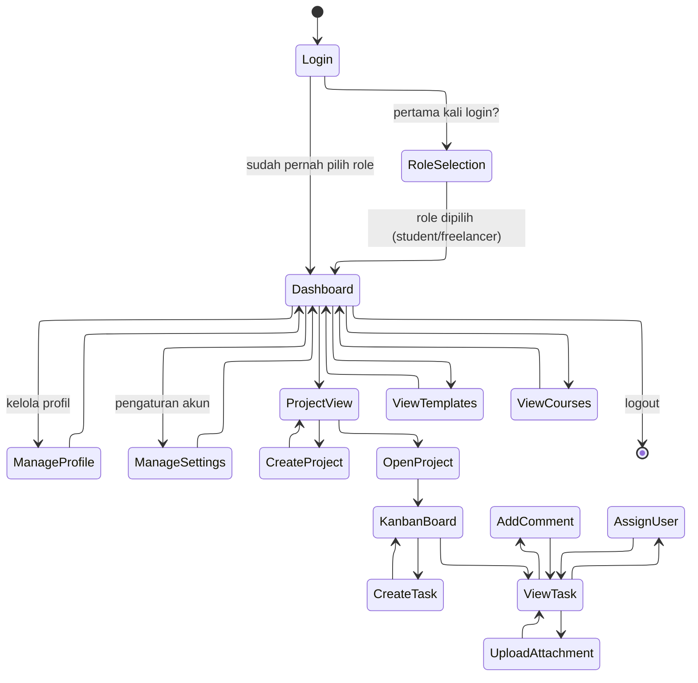

### Activity Diagram - Alur Umum Pengguna

```mermaid
---
config:
  layout: elk
  look: classic
  theme: default
---
%% Activity Diagram - Alur Umum Pengguna
stateDiagram-v2
    [*] --> Login
    Login --> RoleSelection : pertama kali login?
    RoleSelection --> Dashboard : role dipilih (student/freelancer)
    Login --> Dashboard : sudah pernah pilih role

    Dashboard --> ManageProfile : kelola profil
    Dashboard --> ManageSettings : pengaturan akun
    Dashboard --> ProjectView

    ProjectView --> CreateProject
    ProjectView --> OpenProject

    OpenProject --> KanbanBoard
    KanbanBoard --> CreateTask
    KanbanBoard --> ViewTask
    ViewTask --> AddComment
    ViewTask --> UploadAttachment
    ViewTask --> AssignUser

    Dashboard --> ViewTemplates
    Dashboard --> ViewCourses

    ManageProfile --> Dashboard
    ManageSettings --> Dashboard
    CreateProject --> ProjectView
    CreateTask --> KanbanBoard
    AddComment --> ViewTask
    UploadAttachment --> ViewTask
    AssignUser --> ViewTask
    ViewTemplates --> Dashboard
    ViewCourses --> Dashboard

    Dashboard --> [*] : logout
```
