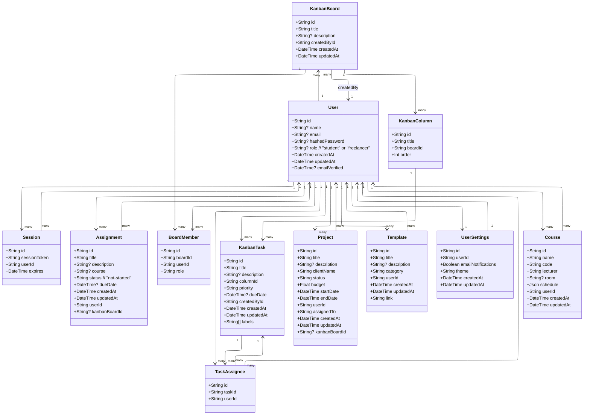

### Class Diagram

```mermaid

---
config:
  theme: default
  look: classic
  layout: elk
---

classDiagram
  direction TB

  class User {
    +String id
    +String? name
    +String? email
    +String? hashedPassword
    +String? role // "student" or "freelancer"
    +DateTime createdAt
    +DateTime updatedAt
    +DateTime? emailVerified
  }

  class Session {
    +String id
    +String sessionToken
    +String userId
    +DateTime expires
  }

  class Assignment {
    +String id
    +String title
    +String? description
    +String? course
    +String status // "not-started"
    +DateTime? dueDate
    +DateTime createdAt
    +DateTime updatedAt
    +String userId
    +String? kanbanBoardId
  }

  class KanbanBoard {
    +String id
    +String title
    +String? description
    +String createdById
    +DateTime createdAt
    +DateTime updatedAt
  }

  class BoardMember {
    +String id
    +String boardId
    +String userId
    +String role
  }

  class KanbanColumn {
    +String id
    +String title
    +String boardId
    +Int order
  }

  class KanbanTask {
    +String id
    +String title
    +String? description
    +String columnId
    +String priority
    +DateTime? dueDate
    +String createdById
    +DateTime createdAt
    +DateTime updatedAt
    +String[] labels
  }

  class TaskAssignee {
    +String id
    +String taskId
    +String userId
  }

  class Project {
    +String id
    +String title
    +String? description
    +String clientName
    +String status
    +Float budget
    +DateTime startDate
    +DateTime endDate
    +String userId
    +String assignedTo
    +DateTime createdAt
    +DateTime updatedAt
    +String? kanbanBoardId
  }

  class Template {
    +String id
    +String title
    +String? description
    +String category
    +String userId
    +DateTime createdAt
    +DateTime updatedAt
    +String link
  }

  class UserSettings {
    +String id
    +String userId
    +Boolean emailNotifications
    +String theme
    +DateTime createdAt
    +DateTime updatedAt
  }

  class Course {
    +String id
    +String name
    +String code
    +String lecturer
    +String? room
    +Json schedule
    +String userId
    +DateTime createdAt
    +DateTime updatedAt
  }

  %% Relationships (Associations & Aggregations)
  User "1" --> "many" Session
  User "1" --> "many" Assignment
  User "1" --> "many" KanbanBoard
  User "1" --> "many" BoardMember
  User "1" --> "many" KanbanTask
  User "1" --> "many" Project
  User "1" --> "many" Template
  User "1" --> "many" TaskAssignee
  User "1" --> "1" UserSettings
  User "1" --> "many" Course

  Session "many" --> "1" User
  Assignment "many" --> "1" User
  KanbanBoard "1" --> "many" BoardMember
  KanbanBoard "1" --> "many" KanbanColumn
  KanbanBoard "many" --> "1" User : createdBy

  KanbanColumn "1" --> "many" KanbanTask
  KanbanTask "1" --> "many" TaskAssignee
  TaskAssignee "many" --> "1" KanbanTask
  TaskAssignee "many" --> "1" User

  Project "many" --> "1" User
  Template "many" --> "1" User
  UserSettings "1" --> "1" User
  Course "many" --> "1" User
```
