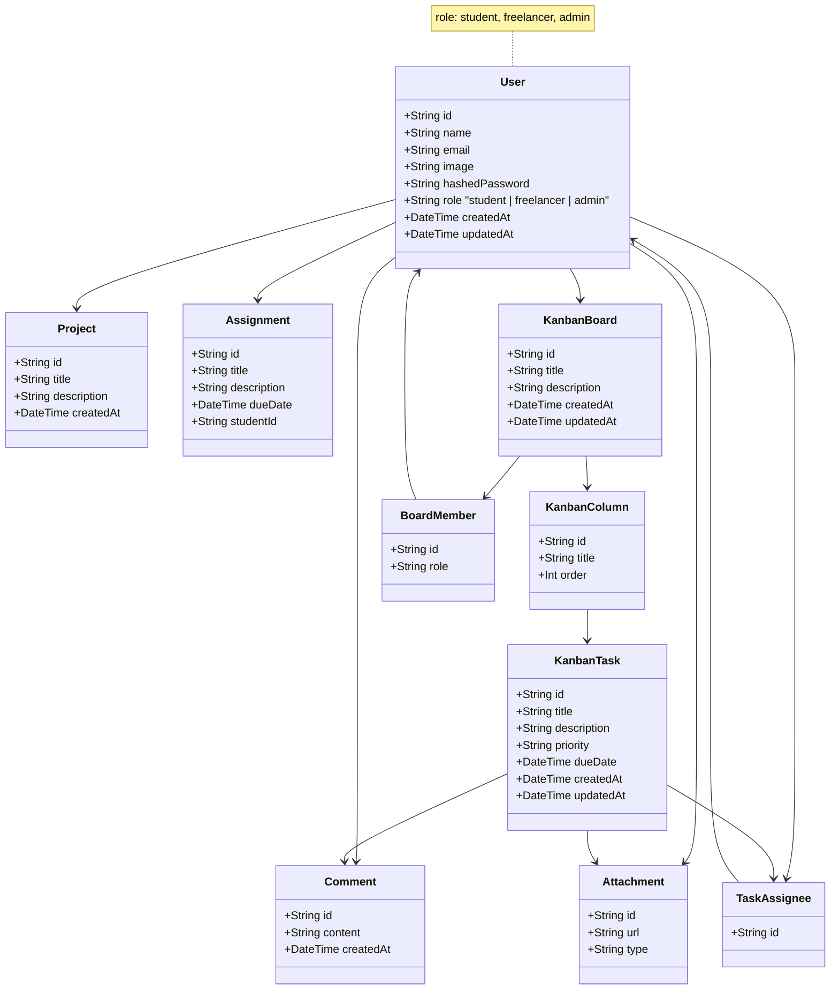

### Class Diagram

```mermaid
classDiagram
  class User {
    +String id
    +String name
    +String email
    +String image
    +String hashedPassword
    +String role "student | freelancer | admin"
    +DateTime createdAt
    +DateTime updatedAt
  }

  class Project {
    +String id
    +String title
    +String description
    +DateTime createdAt
  }

  class Assignment {
    +String id
    +String title
    +String description
    +DateTime dueDate
    +String studentId
  }

  class KanbanBoard {
    +String id
    +String title
    +String description
    +DateTime createdAt
    +DateTime updatedAt
  }

  class KanbanColumn {
    +String id
    +String title
    +Int order
  }

  class KanbanTask {
    +String id
    +String title
    +String description
    +String priority
    +DateTime dueDate
    +DateTime createdAt
    +DateTime updatedAt
  }

  class Comment {
    +String id
    +String content
    +DateTime createdAt
  }

  class Attachment {
    +String id
    +String url
    +String type
  }

  class BoardMember {
    +String id
    +String role
  }

  class TaskAssignee {
    +String id
  }

  User --> Assignment
  User --> Project
  User --> KanbanBoard
  User --> Comment
  User --> Attachment
  User --> TaskAssignee

  KanbanBoard --> KanbanColumn
  KanbanColumn --> KanbanTask
  KanbanTask --> Comment
  KanbanTask --> Attachment
  KanbanTask --> TaskAssignee
  KanbanBoard --> BoardMember
  BoardMember --> User
  TaskAssignee --> User

  note for User "role: student, freelancer, admin"
```
