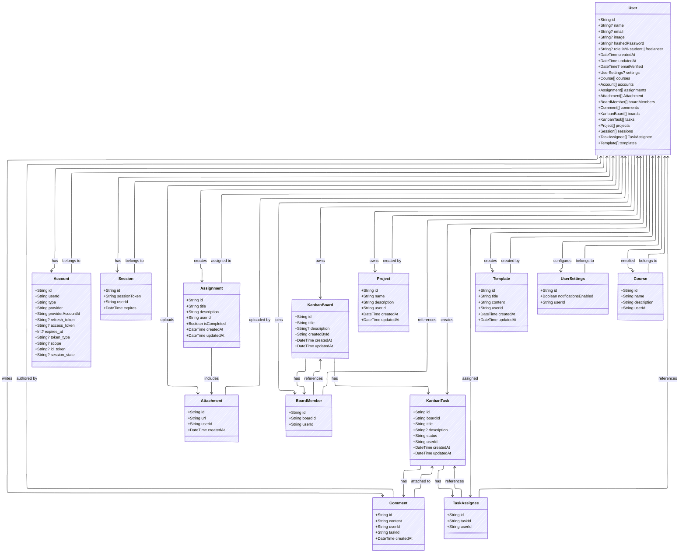

### Class Diagram

```mermaid

---
config:
  theme: default
  look: handDrawn
  layout: elk
---

classDiagram

%%========================
%% === ENTITAS UTAMA ===
%%========================

class User {
  +String id
  +String? name
  +String? email
  +String? image
  +String? hashedPassword
  +String? role  %% student | freelancer
  +DateTime createdAt
  +DateTime updatedAt
  +DateTime? emailVerified
  +UserSettings? settings
  +Course[] courses
  +Account[] accounts
  +Assignment[] assignments
  +Attachment[] Attachment
  +BoardMember[] boardMembers
  +Comment[] comments
  +KanbanBoard[] boards
  +KanbanTask[] tasks
  +Project[] projects
  +Session[] sessions
  +TaskAssignee[] TaskAssignee
  +Template[] templates
}

class Account {
  +String id
  +String userId
  +String type
  +String provider
  +String providerAccountId
  +String? refresh_token
  +String? access_token
  +Int? expires_at
  +String? token_type
  +String? scope
  +String? id_token
  +String? session_state
}

class Session {
  +String id
  +String sessionToken
  +String userId
  +DateTime expires
}

class Assignment {
  +String id
  +String title
  +String description
  +String userId
  +Boolean isCompleted
  +DateTime createdAt
  +DateTime updatedAt
}

class Attachment {
  +String id
  +String url
  +String userId
  +DateTime createdAt
}

class BoardMember {
  +String id
  +String boardId
  +String userId
}

class Comment {
  +String id
  +String content
  +String userId
  +String taskId
  +DateTime createdAt
}

class KanbanBoard {
  +String id
  +String title
  +String? description
  +String createdById
  +DateTime createdAt
  +DateTime updatedAt
}

class KanbanTask {
  +String id
  +String boardId
  +String title
  +String? description
  +String status
  +String userId
  +DateTime createdAt
  +DateTime updatedAt
}

class Project {
  +String id
  +String name
  +String description
  +String userId
  +DateTime createdAt
  +DateTime updatedAt
}

class TaskAssignee {
  +String id
  +String taskId
  +String userId
}

class Template {
  +String id
  +String title
  +String content
  +String userId
  +DateTime createdAt
  +DateTime updatedAt
}

class UserSettings {
  +String id
  +Boolean notificationsEnabled
  +String userId
}

class Course {
  +String id
  +String name
  +String description
  +String userId
}

%%========================
%% === RELASI ANTAR KELAS ===
%%========================

User --> Account : has
User --> Session : has
User --> Assignment : creates
User --> Attachment : uploads
User --> BoardMember : joins
User --> Comment : writes
User --> KanbanBoard : owns
User --> KanbanTask : creates
User --> Project : owns
User --> TaskAssignee : assigned
User --> Template : creates
User --> UserSettings : configures
User --> Course : enrolled

KanbanBoard --> BoardMember : has
KanbanBoard --> KanbanTask : has
KanbanTask --> Comment : has
KanbanTask --> TaskAssignee : has

Assignment --> Attachment : includes

TaskAssignee --> User : references
TaskAssignee --> KanbanTask : references
BoardMember --> User : references
BoardMember --> KanbanBoard : references

Session --> User : belongs to
Account --> User : belongs to
Course --> User : belongs to
UserSettings --> User : belongs to
Template --> User : created by
Project --> User : created by
Comment --> User : authored by
Comment --> KanbanTask : attached to
Attachment --> User : uploaded by
Assignment --> User : assigned to

```
