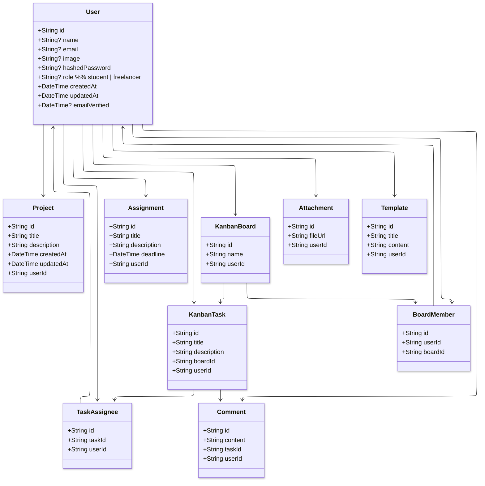

### Class Diagram

```mermaid

---
config:
  theme: default
  look: neo
  layout: elk
---

classDiagram
  class User {
    +String id
    +String? name
    +String? email
    +String? image
    +String? hashedPassword
    +String? role  %% student | freelancer
    +DateTime createdAt
    +DateTime updatedAt
    +DateTime? emailVerified
  }

  class Project {
    +String id
    +String title
    +String description
    +DateTime createdAt
    +DateTime updatedAt
    +String userId
  }

  class Assignment {
    +String id
    +String title
    +String description
    +DateTime deadline
    +String userId
  }

  class KanbanBoard {
    +String id
    +String name
    +String userId
  }

  class KanbanTask {
    +String id
    +String title
    +String description
    +String boardId
    +String userId
  }

  class BoardMember {
    +String id
    +String userId
    +String boardId
  }

  class TaskAssignee {
    +String id
    +String taskId
    +String userId
  }

  class Comment {
    +String id
    +String content
    +String taskId
    +String userId
  }

  class Attachment {
    +String id
    +String fileUrl
    +String userId
  }

  class Template {
    +String id
    +String title
    +String content
    +String userId
  }

  User --> Project
  User --> Assignment
  User --> KanbanBoard
  User --> KanbanTask
  User --> BoardMember
  User --> TaskAssignee
  User --> Comment
  User --> Attachment
  User --> Template

  KanbanBoard --> KanbanTask
  KanbanBoard --> BoardMember
  KanbanTask --> Comment
  KanbanTask --> TaskAssignee
  BoardMember --> User
  TaskAssignee --> User

```
