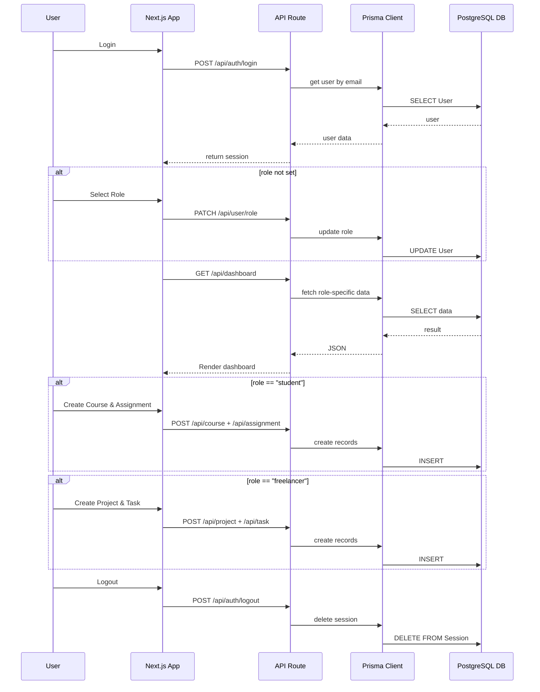

### Sequence Diagram

```mermaid
---
config:
  look: classic
  theme: default
---
sequenceDiagram
  participant User
  participant Next.js App
  participant API Route
  participant Prisma Client
  participant PostgreSQL DB
  User->>Next.js App: Login
  Next.js App->>API Route: POST /api/auth/login
  API Route->>Prisma Client: get user by email
  Prisma Client->>PostgreSQL DB: SELECT User
  PostgreSQL DB-->>Prisma Client: user
  Prisma Client-->>API Route: user data
  API Route-->>Next.js App: return session
  alt role not set
    User->>Next.js App: Select Role
    Next.js App->>API Route: PATCH /api/user/role
    API Route->>Prisma Client: update role
    Prisma Client->>PostgreSQL DB: UPDATE User
  end
  Next.js App->>API Route: GET /api/dashboard
  API Route->>Prisma Client: fetch role-specific data
  Prisma Client->>PostgreSQL DB: SELECT data
  PostgreSQL DB-->>Prisma Client: result
  Prisma Client-->>API Route: JSON
  API Route-->>Next.js App: Render dashboard
  alt role == "student"
    User->>Next.js App: Create Course & Assignment
    Next.js App->>API Route: POST /api/course + /api/assignment
    API Route->>Prisma Client: create records
    Prisma Client->>PostgreSQL DB: INSERT
  end
  alt role == "freelancer"
    User->>Next.js App: Create Project & Task
    Next.js App->>API Route: POST /api/project + /api/task
    API Route->>Prisma Client: create records
    Prisma Client->>PostgreSQL DB: INSERT
  end
  User->>Next.js App: Logout
  Next.js App->>API Route: POST /api/auth/logout
  API Route->>Prisma Client: delete session
  Prisma Client->>PostgreSQL DB: DELETE FROM Session
```
