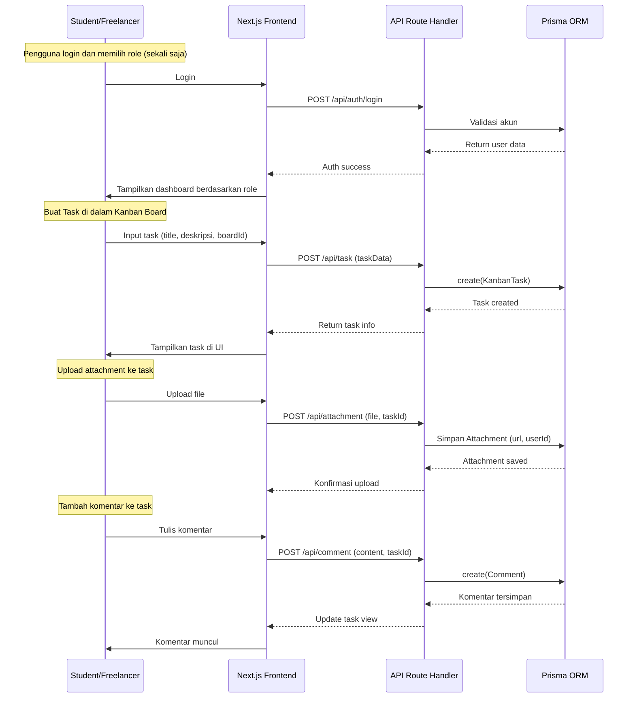

### Sequence Diagram

```mermaid
---
config:
  look: classic
  theme: default
---
sequenceDiagram
    participant User as Student/Freelancer
    participant UI as Next.js Frontend
    participant API as API Route Handler
    participant DB as Prisma ORM

    Note over User: Pengguna login dan memilih role (sekali saja)
    User->>UI: Login
    UI->>API: POST /api/auth/login
    API->>DB: Validasi akun
    DB-->>API: Return user data
    API-->>UI: Auth success
    UI->>User: Tampilkan dashboard berdasarkan role

    Note over User: Buat Task di dalam Kanban Board
    User->>UI: Input task (title, deskripsi, boardId)
    UI->>API: POST /api/task (taskData)
    API->>DB: create(KanbanTask)
    DB-->>API: Task created
    API-->>UI: Return task info
    UI->>User: Tampilkan task di UI

    Note over User: Upload attachment ke task
    User->>UI: Upload file
    UI->>API: POST /api/attachment (file, taskId)
    API->>DB: Simpan Attachment (url, userId)
    DB-->>API: Attachment saved
    API-->>UI: Konfirmasi upload

    Note over User: Tambah komentar ke task
    User->>UI: Tulis komentar
    UI->>API: POST /api/comment (content, taskId)
    API->>DB: create(Comment)
    DB-->>API: Komentar tersimpan
    API-->>UI: Update task view
    UI->>User: Komentar muncul
```
