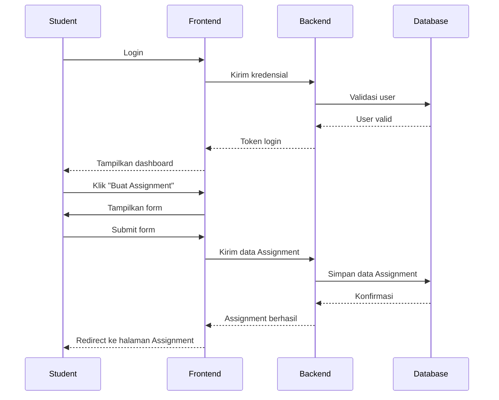
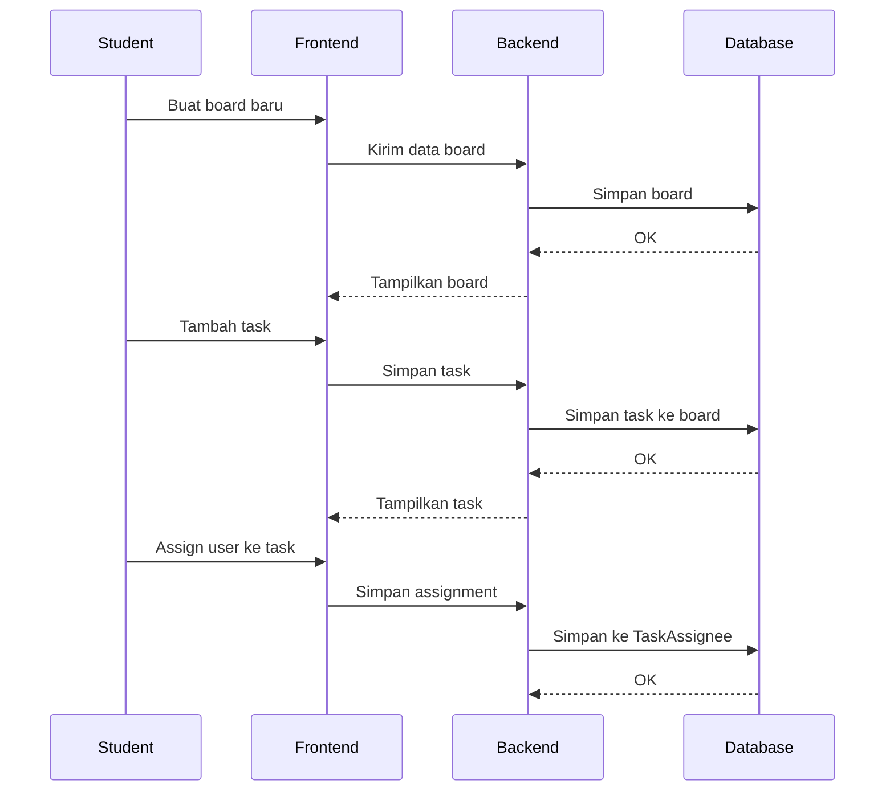
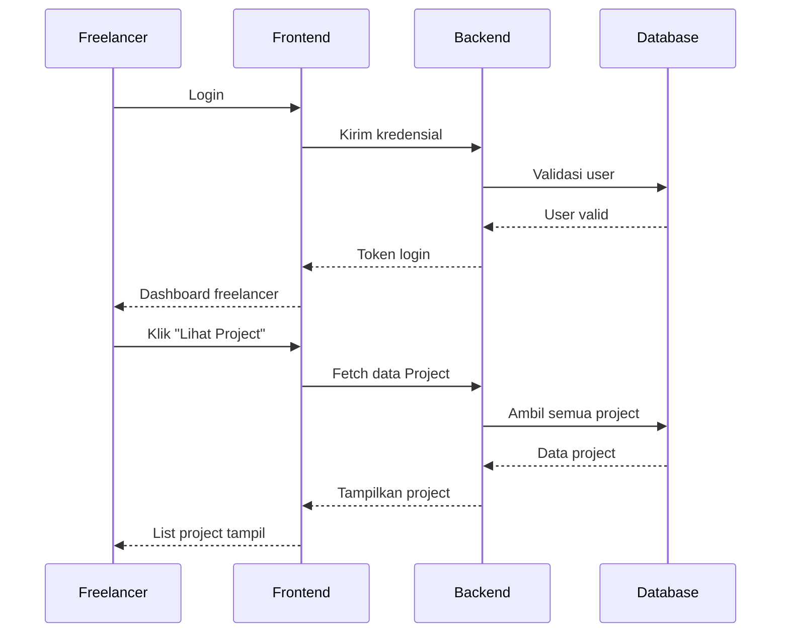
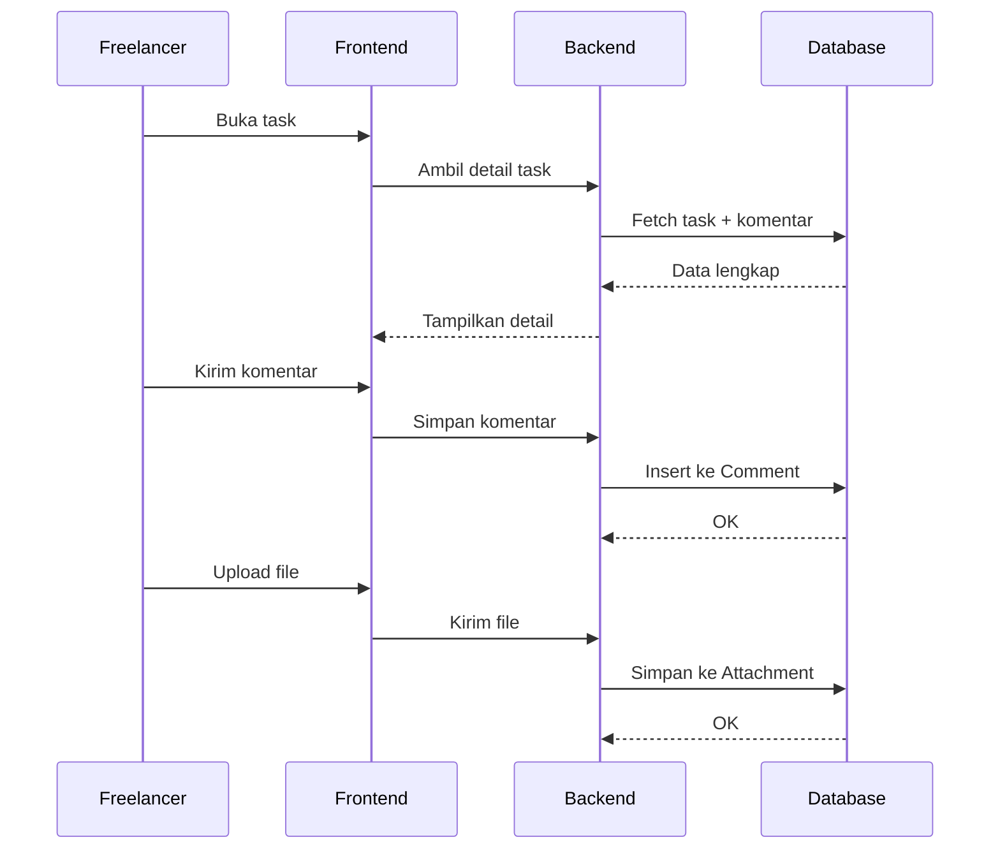

### Sequence Diagram Lengkap untuk Semua Role

#### Mahasiswa Membuat Assignment

#### Mahasiswa Mengelola Kanban

#### Freelancer Melihat dan Mengambil Project

#### Freelancer Komentar dan Upload
<<<<<<< HEAD

=======
>>>>>>> bd9ebe384a77c79410868d5342db204afca197fb

