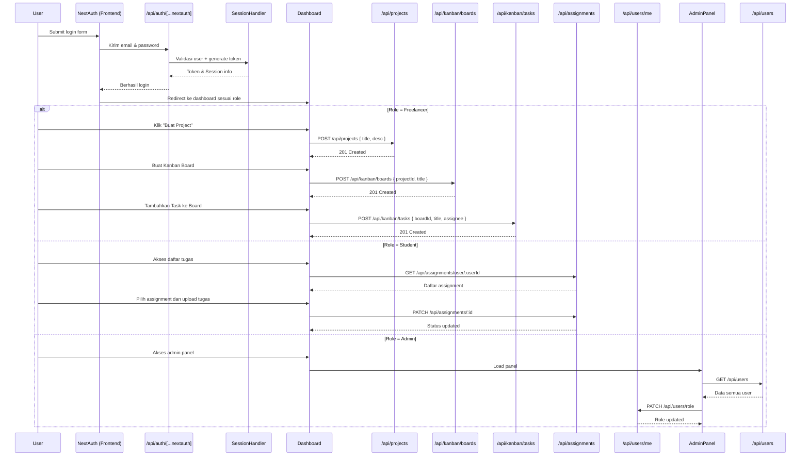

### Sequence Diagram Lengkap untuk Semua Role

```mermaid
sequenceDiagram
  participant User
  participant NextAuthClient as NextAuth (Frontend)
  participant AuthRoute as /api/auth/[...nextauth]
  participant Session as SessionHandler
  participant Dashboard
  participant API_Project as /api/projects
  participant API_KanbanBoard as /api/kanban/boards
  participant API_Task as /api/kanban/tasks
  participant API_Assignment as /api/assignments
  participant API_User as /api/users/me
  participant AdminPanel as AdminPanel
  participant API_Users as /api/users

  User->>NextAuthClient: Submit login form
  NextAuthClient->>AuthRoute: Kirim email & password
  AuthRoute->>Session: Validasi user + generate token
  Session-->>AuthRoute: Token & Session info
  AuthRoute-->>NextAuthClient: Berhasil login

  NextAuthClient->>Dashboard: Redirect ke dashboard sesuai role

  alt Role = Freelancer
    User->>Dashboard: Klik "Buat Project"
    Dashboard->>API_Project: POST /api/projects { title, desc }
    API_Project-->>Dashboard: 201 Created

    User->>Dashboard: Buat Kanban Board
    Dashboard->>API_KanbanBoard: POST /api/kanban/boards { projectId, title }
    API_KanbanBoard-->>Dashboard: 201 Created

    User->>Dashboard: Tambahkan Task ke Board
    Dashboard->>API_Task: POST /api/kanban/tasks { boardId, title, assignee }
    API_Task-->>Dashboard: 201 Created

  else Role = Student
    User->>Dashboard: Akses daftar tugas
    Dashboard->>API_Assignment: GET /api/assignments/user/:userId
    API_Assignment-->>Dashboard: Daftar assignment

    User->>Dashboard: Pilih assignment dan upload tugas
    Dashboard->>API_Assignment: PATCH /api/assignments/:id
    API_Assignment-->>Dashboard: Status updated

  else Role = Admin
    User->>Dashboard: Akses admin panel
    Dashboard->>AdminPanel: Load panel

    AdminPanel->>API_Users: GET /api/users
    API_Users-->>AdminPanel: Data semua user

    AdminPanel->>API_User: PATCH /api/users/role
    API_User-->>AdminPanel: Role updated
  end
```
