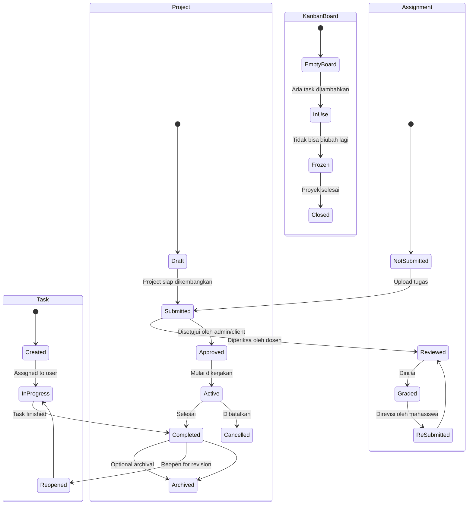

### **State Diagram**

```mermaid
stateDiagram

  state Task {
    [*] --> Created
    Created --> InProgress : Assigned to user
    InProgress --> Completed : Task finished
    Completed --> Archived : Optional archival
    Completed --> Reopened : Reopen for revision
    Reopened --> InProgress
  }

  state Assignment {
    [*] --> NotSubmitted
    NotSubmitted --> Submitted : Upload tugas
    Submitted --> Reviewed : Diperiksa oleh dosen
    Reviewed --> Graded : Dinilai
    Graded --> ReSubmitted : Direvisi oleh mahasiswa
    ReSubmitted --> Reviewed
  }

  state Project {
    [*] --> Draft
    Draft --> Submitted : Project siap dikembangkan
    Submitted --> Approved : Disetujui oleh admin/client
    Approved --> Active : Mulai dikerjakan
    Active --> Completed : Selesai
    Active --> Cancelled : Dibatalkan
    Completed --> Archived
  }

  state KanbanBoard {
    [*] --> EmptyBoard
    EmptyBoard --> InUse : Ada task ditambahkan
    InUse --> Frozen : Tidak bisa diubah lagi
    Frozen --> Closed : Proyek selesai
  }
```
