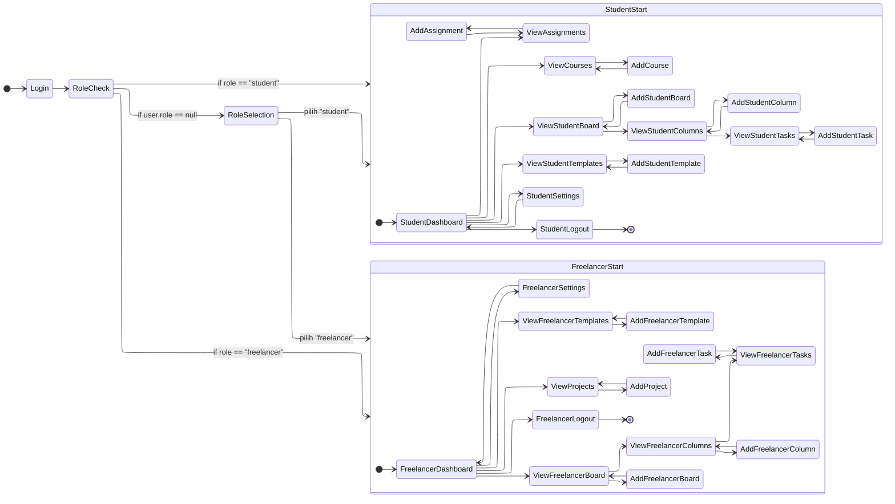

### State Diagram

```mermaid
---
config:
  layout: elk
  theme: default
---
stateDiagram
  direction LR
  state StudentStart {
    direction LR
    [*] --> StudentDashboard
    StudentDashboard --> ViewCourses
    ViewCourses --> AddCourse
    AddCourse --> ViewCourses
    StudentDashboard --> ViewAssignments
    ViewAssignments --> AddAssignment
    AddAssignment --> ViewAssignments
    StudentDashboard --> ViewStudentBoard
    ViewStudentBoard --> AddStudentBoard
    AddStudentBoard --> ViewStudentBoard
    ViewStudentBoard --> ViewStudentColumns
    ViewStudentColumns --> AddStudentColumn
    AddStudentColumn --> ViewStudentColumns
    ViewStudentColumns --> ViewStudentTasks
    ViewStudentTasks --> AddStudentTask
    AddStudentTask --> ViewStudentTasks
    StudentDashboard --> ViewStudentTemplates
    ViewStudentTemplates --> AddStudentTemplate
    AddStudentTemplate --> ViewStudentTemplates
    StudentDashboard --> StudentSettings
    StudentSettings --> StudentDashboard
    StudentDashboard --> StudentLogout
    StudentLogout --> [*]
[*]    StudentDashboard
    ViewCourses
    AddCourse
    ViewAssignments
    AddAssignment
    ViewStudentBoard
    AddStudentBoard
    ViewStudentColumns
    AddStudentColumn
    ViewStudentTasks
    AddStudentTask
    ViewStudentTemplates
    AddStudentTemplate
    StudentSettings
    StudentLogout
[*]  }
  state FreelancerStart {
    direction LR
    [*] --> FreelancerDashboard
    FreelancerDashboard --> ViewProjects
    ViewProjects --> AddProject
    AddProject --> ViewProjects
    FreelancerDashboard --> ViewFreelancerBoard
    ViewFreelancerBoard --> AddFreelancerBoard
    AddFreelancerBoard --> ViewFreelancerBoard
    ViewFreelancerBoard --> ViewFreelancerColumns
    ViewFreelancerColumns --> AddFreelancerColumn
    AddFreelancerColumn --> ViewFreelancerColumns
    ViewFreelancerColumns --> ViewFreelancerTasks
    ViewFreelancerTasks --> AddFreelancerTask
    AddFreelancerTask --> ViewFreelancerTasks
    FreelancerDashboard --> ViewFreelancerTemplates
    ViewFreelancerTemplates --> AddFreelancerTemplate
    AddFreelancerTemplate --> ViewFreelancerTemplates
    FreelancerDashboard --> FreelancerSettings
    FreelancerSettings --> FreelancerDashboard
    FreelancerDashboard --> FreelancerLogout
    FreelancerLogout --> [*]
[*]    FreelancerDashboard
    ViewProjects
    AddProject
    ViewFreelancerBoard
    AddFreelancerBoard
    ViewFreelancerColumns
    AddFreelancerColumn
    ViewFreelancerTasks
    AddFreelancerTask
    ViewFreelancerTemplates
    AddFreelancerTemplate
    FreelancerSettings
    FreelancerLogout
[*]  }
  [*] --> Login
  Login --> RoleCheck
  RoleCheck --> RoleSelection:if user.role == null
  RoleSelection --> StudentStart:pilih "student"
  RoleSelection --> FreelancerStart:pilih "freelancer"
  RoleCheck --> StudentStart:if role == "student"
  RoleCheck --> FreelancerStart:if role == "freelancer"
```
