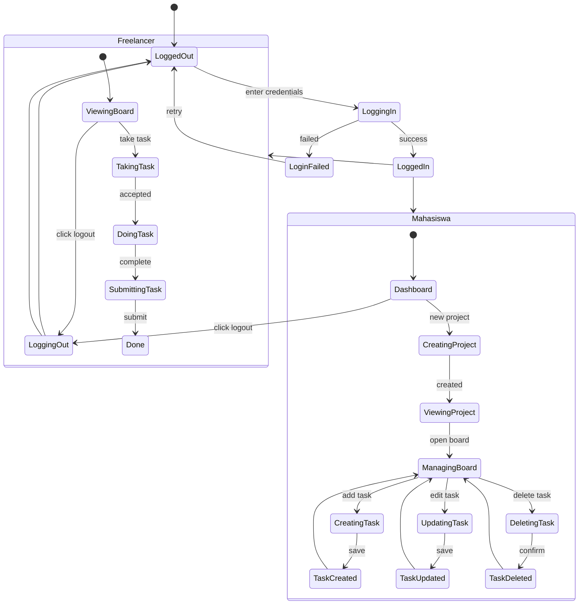

### **State Diagram**

```mermaid
stateDiagram-v2
    direction TB

    [*] --> LoggedOut

    LoggedOut --> LoggingIn : enter credentials
    LoggingIn --> LoggedIn : success
    LoggingIn --> LoginFailed : failed
    LoginFailed --> LoggedOut : retry

    LoggedIn --> Mahasiswa
    LoggedIn --> Freelancer

    state Mahasiswa {
        [*] --> Dashboard

        Dashboard --> CreatingProject : new project
        CreatingProject --> ViewingProject : created

        ViewingProject --> ManagingBoard : open board

        ManagingBoard --> CreatingTask : add task
        CreatingTask --> TaskCreated : save
        TaskCreated --> ManagingBoard

        ManagingBoard --> UpdatingTask : edit task
        UpdatingTask --> TaskUpdated : save
        TaskUpdated --> ManagingBoard

        ManagingBoard --> DeletingTask : delete task
        DeletingTask --> TaskDeleted : confirm
        TaskDeleted --> ManagingBoard

        Dashboard --> LoggingOut : click logout
        LoggingOut --> LoggedOut
    }

    state Freelancer {
        [*] --> ViewingBoard

        ViewingBoard --> TakingTask : take task
        TakingTask --> DoingTask : accepted
        DoingTask --> SubmittingTask : complete
        SubmittingTask --> Done : submit

        ViewingBoard --> LoggingOut : click logout
        LoggingOut --> LoggedOut
    }
```
