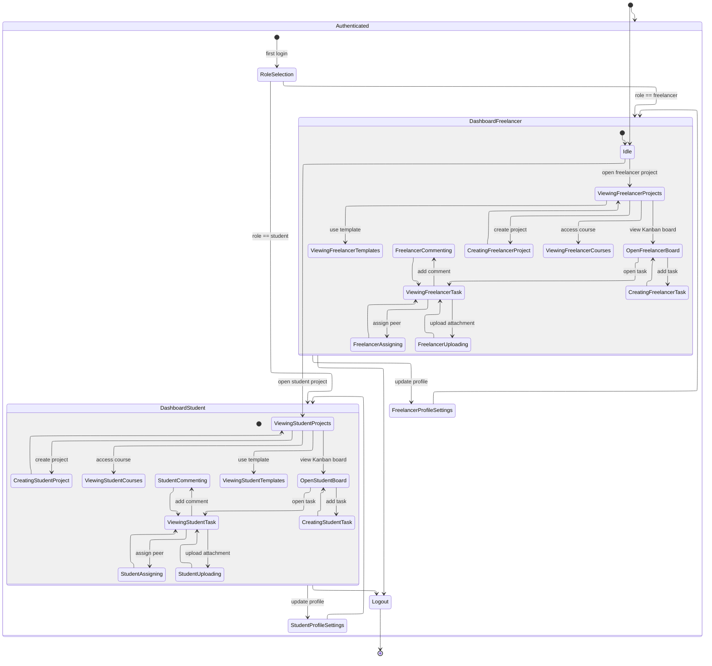

### State Diagram

```mermaid
---
config:
  layout: elk
  look: classic
  theme: default
---
stateDiagram
  direction TB
  state Authenticated {
    direction TB
    [*] --> RoleSelection:first login
    RoleSelection --> DashboardStudent:role == student
    RoleSelection --> DashboardFreelancer:role == freelancer
    DashboardStudent --> StudentProfileSettings:update profile
    StudentProfileSettings --> DashboardStudent
    DashboardFreelancer --> FreelancerProfileSettings:update profile
    FreelancerProfileSettings --> DashboardFreelancer
    DashboardStudent --> Logout
    DashboardFreelancer --> Logout
    state DashboardStudent {
      direction TB
      ViewingStudentProjects --> CreatingStudentProject:create project
      CreatingStudentProject --> ViewingStudentProjects
      ViewingStudentProjects --> OpenStudentBoard:view Kanban board
      OpenStudentBoard --> CreatingStudentTask:add task
      CreatingStudentTask --> OpenStudentBoard
      OpenStudentBoard --> ViewingStudentTask:open task
      ViewingStudentTask --> StudentCommenting:add comment
      ViewingStudentTask --> StudentUploading:upload attachment
      ViewingStudentTask --> StudentAssigning:assign peer
      StudentCommenting --> ViewingStudentTask
      StudentUploading --> ViewingStudentTask
      StudentAssigning --> ViewingStudentTask
      ViewingStudentProjects --> ViewingStudentCourses:access course
      ViewingStudentProjects --> ViewingStudentTemplates:use template
      [*]
    }
    state DashboardFreelancer {
      direction TB
      [*] --> Idle
      Idle --> ViewingFreelancerProjects:open freelancer project
      ViewingFreelancerProjects --> CreatingFreelancerProject:create project
      CreatingFreelancerProject --> ViewingFreelancerProjects
      ViewingFreelancerProjects --> OpenFreelancerBoard:view Kanban board
      OpenFreelancerBoard --> CreatingFreelancerTask:add task
      CreatingFreelancerTask --> OpenFreelancerBoard
      OpenFreelancerBoard --> ViewingFreelancerTask:open task
      ViewingFreelancerTask --> FreelancerCommenting:add comment
      ViewingFreelancerTask --> FreelancerUploading:upload attachment
      ViewingFreelancerTask --> FreelancerAssigning:assign peer
      FreelancerCommenting --> ViewingFreelancerTask
      FreelancerUploading --> ViewingFreelancerTask
      FreelancerAssigning --> ViewingFreelancerTask
      ViewingFreelancerProjects --> ViewingFreelancerCourses:access course
      ViewingFreelancerProjects --> ViewingFreelancerTemplates:use template
      Idle
[*]      ViewingFreelancerProjects
      CreatingFreelancerProject
      OpenFreelancerBoard
      CreatingFreelancerTask
      ViewingFreelancerTask
      FreelancerCommenting
      FreelancerUploading
      FreelancerAssigning
      ViewingFreelancerCourses
      ViewingFreelancerTemplates
    }
  }
  [*] --> Authenticated
  [*] --> Idle
  Idle --> ViewingStudentProjects:open student project
  Logout --> [*]
```
