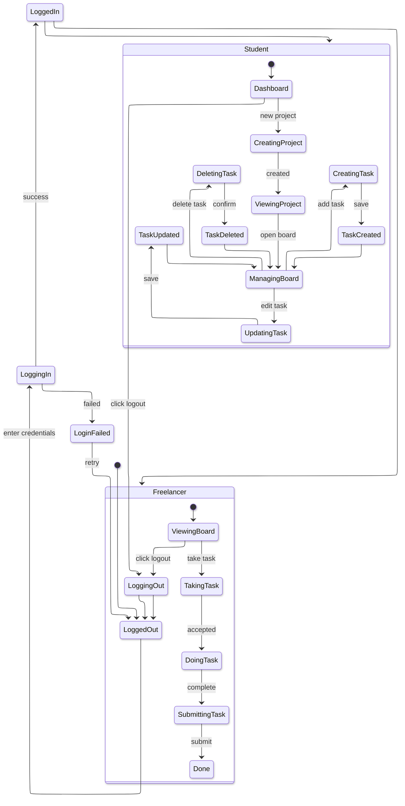

### State Diagram

```mermaid
---
config:
  layout: elk
  look: neo
  theme: default
---
stateDiagram
  direction TB
  state Student {
    direction TB
    [*] --> Dashboard
    Dashboard --> CreatingProject:new project
    CreatingProject --> ViewingProject:created
    ViewingProject --> ManagingBoard:open board
    ManagingBoard --> CreatingTask:add task
    CreatingTask --> TaskCreated:save
    TaskCreated --> ManagingBoard
    ManagingBoard --> UpdatingTask:edit task
    UpdatingTask --> TaskUpdated:save
    TaskUpdated --> ManagingBoard
    ManagingBoard --> DeletingTask:delete task
    DeletingTask --> TaskDeleted:confirm
    TaskDeleted --> ManagingBoard
[*]    Dashboard
    CreatingProject
    ViewingProject
    ManagingBoard
    CreatingTask
    TaskCreated
    UpdatingTask
    TaskUpdated
    DeletingTask
    TaskDeleted
  }
  state Freelancer {
    direction TB
    LoggingOut --> LoggedOut
    [*] --> ViewingBoard
    ViewingBoard --> TakingTask:take task
    TakingTask --> DoingTask:accepted
    DoingTask --> SubmittingTask:complete
    SubmittingTask --> Done:submit
    ViewingBoard --> LoggingOut:click logout
    LoggingOut --> LoggedOut
    LoggingOut
    LoggedOut
[*]    ViewingBoard
    TakingTask
    DoingTask
    SubmittingTask
    Done
  }
  [*] --> LoggedOut
  LoggedOut --> LoggingIn:enter credentials
  LoggingIn --> LoggedIn:success
  LoggingIn --> LoginFailed:failed
  LoginFailed --> LoggedOut:retry
  LoggedIn --> Student
  LoggedIn --> Freelancer
  Dashboard --> LoggingOut:click logout
```
