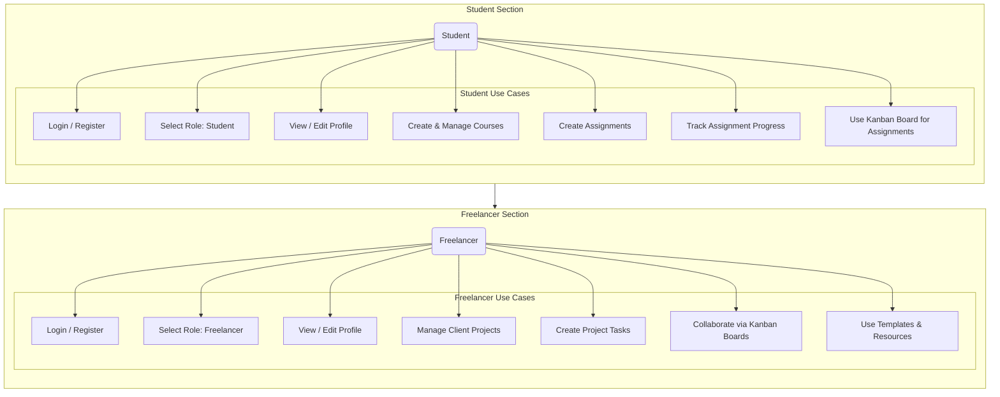

### Use Case Diagram

```mermaid
---
config:
  look: classic
  theme: default
---
%% File: diagrams/useCaseDiagram.md
%% Mermaid Use Case Diagram
%% Role bersifat eksklusif: student dan freelancer tidak saling berinteraksi

%% Mermaid doesn't have built-in support for use case, but we use flowchart to force vertical layout
flowchart TD
  %% External actors
  UserStudent(Student)

  subgraph StudentSection["Student Section"]
    direction TB

    subgraph StudentUseCase["Student Use Cases"]
      S1[Login / Register]
      S2[Select Role: Student]
      S3[View / Edit Profile]
      S4[Create & Manage Courses]
      S5[Create Assignments]
      S6[Track Assignment Progress]
      S7[Use Kanban Board for Assignments]
    end

    %% Student Use Case Mapping
    UserStudent --> S1
    UserStudent --> S2
    UserStudent --> S3
    UserStudent --> S4
    UserStudent --> S5
    UserStudent --> S6
    UserStudent --> S7
  end

  UserFreelancer(Freelancer)

  subgraph FreelancerSection["Freelancer Section"]
    direction TB

    subgraph FreelancerUseCase["Freelancer Use Cases"]
      F1[Login / Register]
      F2[Select Role: Freelancer]
      F3[View / Edit Profile]
      F4[Manage Client Projects]
      F5[Create Project Tasks]
      F6[Collaborate via Kanban Boards]
      F7[Use Templates & Resources]
    end

    %% Freelancer Use Case Mapping
    UserFreelancer --> F1
    UserFreelancer --> F2
    UserFreelancer --> F3
    UserFreelancer --> F4
    UserFreelancer --> F5
    UserFreelancer --> F6
    UserFreelancer --> F7
  end

  %% Force vertical layout
  StudentSection --> FreelancerSection
```
