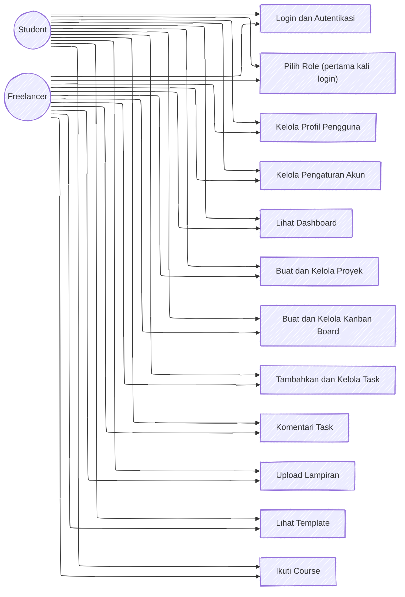

### Use Case Diagram

```mermaid
---
config:
  look: handDrawn
  layout: elk
  theme: default
---
%% Use Case Diagram
%% Sistem Manajemen Proyek Kolaboratif dengan Role Student & Freelancer

%% Aktor: Student & Freelancer tidak berinteraksi satu sama lain dan memiliki fitur yang hampir serupa
graph LR
    actorStudent((Student))
    actorFreelancer((Freelancer))

    %% Use Case Utama
    UC1["Login dan Autentikasi"]
    UC2["Pilih Role (pertama kali login)"]
    UC3["Kelola Profil Pengguna"]
    UC4["Kelola Pengaturan Akun"]
    UC5["Lihat Dashboard"]
    UC6["Buat dan Kelola Proyek"]
    UC7["Buat dan Kelola Kanban Board"]
    UC8["Tambahkan dan Kelola Task"]
    UC9["Komentari Task"]
    UC10["Upload Lampiran"]
    UC11["Lihat Template"]
    UC12["Ikuti Course"]

    %% Relasi Student
    actorStudent --> UC1
    actorStudent --> UC2
    actorStudent --> UC3
    actorStudent --> UC4
    actorStudent --> UC5
    actorStudent --> UC6
    actorStudent --> UC7
    actorStudent --> UC8
    actorStudent --> UC9
    actorStudent --> UC10
    actorStudent --> UC11
    actorStudent --> UC12

    %% Relasi Freelancer (identik, karena fitur mirip tapi eksklusif)
    actorFreelancer --> UC1
    actorFreelancer --> UC2
    actorFreelancer --> UC3
    actorFreelancer --> UC4
    actorFreelancer --> UC5
    actorFreelancer --> UC6
    actorFreelancer --> UC7
    actorFreelancer --> UC8
    actorFreelancer --> UC9
    actorFreelancer --> UC10
    actorFreelancer --> UC11
    actorFreelancer --> UC12
```
