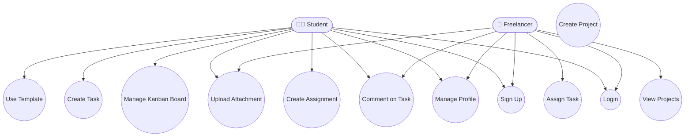

### Use Case Diagram

```mermaid
%% Use Case Diagram for Student & Freelancer Roles

%% Mermaid doesn't have native support for UML use case diagrams,
%% so we simulate it with graph TD + subgraph and styling

graph TD
  %% Actors
  actorStudent(["👩‍🎓 Student"])
  actorFreelancer(["💼 Freelancer"])

  %% Use cases
  login((Login))
  signup((Sign Up))
  manageProfile((Manage Profile))
  createProject((Create Project))
  viewProjects((View Projects))
  createAssignment((Create Assignment))
  manageBoard((Manage Kanban Board))
  createTask((Create Task))
  assignTask((Assign Task))
  commentTask((Comment on Task))
  uploadAttachment((Upload Attachment))
  useTemplate((Use Template))

  %% Relationships
  actorStudent --> login
  actorStudent --> signup
  actorStudent --> manageProfile
  actorStudent --> createAssignment
  actorStudent --> manageBoard
  actorStudent --> createTask
  actorStudent --> commentTask
  actorStudent --> uploadAttachment
  actorStudent --> useTemplate

  actorFreelancer --> login
  actorFreelancer --> signup
  actorFreelancer --> manageProfile
  actorFreelancer --> viewProjects
  actorFreelancer --> assignTask
  actorFreelancer --> commentTask
  actorFreelancer --> uploadAttachment
```
