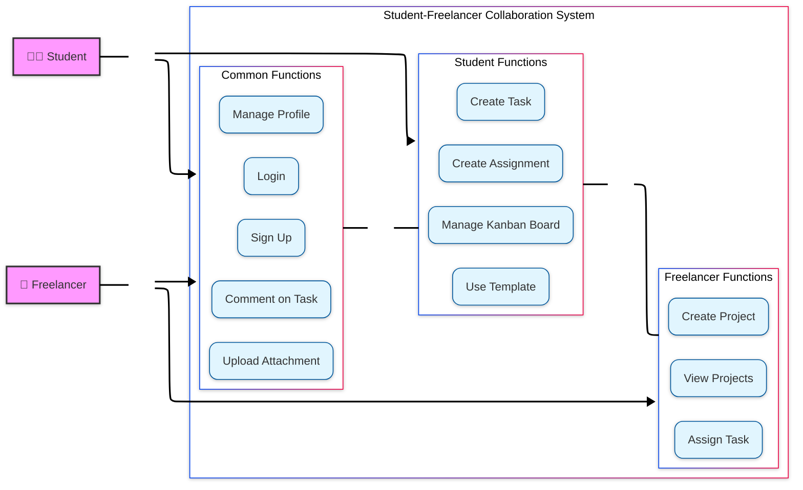

### Use Case Diagram

```mermaid
---
config:
  layout: elk
  look: neo
  theme: neo
---
%% Use Case Diagram for Student & Freelancer Roles - with styled boxes

flowchart LR
  %% Actors with custom styling
  actorStudent["👩‍🎓 Student"]:::actor
  actorFreelancer["💼 Freelancer"]:::actor

  %% Add invisible spacing nodes
  space1[" "]:::invisible
  space2[" "]:::invisible

  %% Connect invisible nodes for spacing
  actorStudent --- space1
  actorFreelancer --- space2

  %% System boundary with added padding
  subgraph System[" Student-Freelancer Collaboration System "]
    direction LR
    %% Common use cases
    subgraph Common[" Common Functions "]
      direction TB
      login["Login"]:::useCase
      signup["Sign Up"]:::useCase
      manageProfile["Manage Profile"]:::useCase
      commentTask["Comment on Task"]:::useCase
      uploadAttachment["Upload Attachment"]:::useCase
    end

    %% Add spacing between subgraphs
    middleSpace1[" "]:::invisible
    Common --- middleSpace1 --- StudentFunctions

    %% Student specific use cases
    subgraph StudentFunctions[" Student Functions "]
      direction TB
      createAssignment["Create Assignment"]:::useCase
      manageBoard["Manage Kanban Board"]:::useCase
      createTask["Create Task"]:::useCase
      useTemplate["Use Template"]:::useCase
    end

    %% Add spacing between subgraphs
    middleSpace2[" "]:::invisible
    StudentFunctions --- middleSpace2 --- FreelancerFunctions

    %% Freelancer specific use cases
    subgraph FreelancerFunctions[" Freelancer Functions "]
      direction TB
      viewProjects["View Projects"]:::useCase
      assignTask["Assign Task"]:::useCase
      createProject["Create Project"]:::useCase
    end
  end

  %% Relationships with cleaner layout (using space nodes)
  space1 --> StudentFunctions
  space1 --> Common

  space2 --> Common
  space2 --> FreelancerFunctions

  %% Custom styling
  classDef actor fill:#f9f,stroke:#333,stroke-width:2px
  classDef useCase fill:#e1f5fe,stroke:#01579b,stroke-width:1px,rx:10px,ry:10px
  classDef system fill:#f5f5f5,stroke:#616161,stroke-width:1px,stroke-dasharray: 5 5,padding:15px
  classDef invisible fill:none,stroke:none,opacity:0
```
